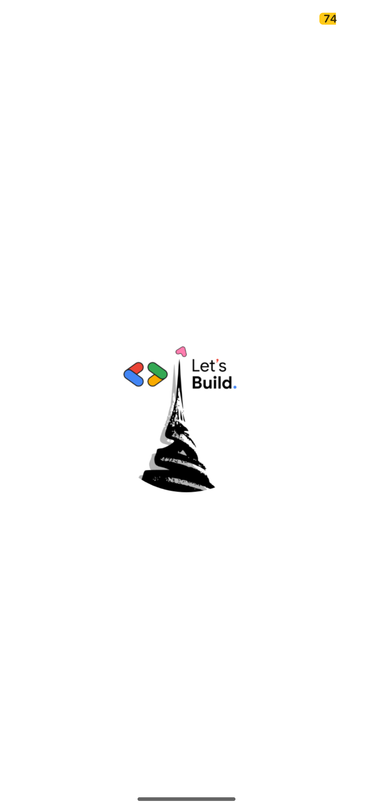

# Gyde

An open-source Flutter AI chat app that uses Firebase + Vertex AI (via `firebase_ai`) to provide a
lightweight assistant focused on GDG communities in Cameroon (with emphasis on GDG Yaoundé).

The app features a clean chat UI with Markdown rendering, media attachment previews (images/videos),
quick suggestions, copy/share actions, and theming. Firebase is initialized at startup and the AI
model + system instruction are centrally configured.

## Features

- Chat with a Gemini model through Firebase AI (Vertex AI)
- Central AI configuration (model + system instruction)
- Markdown responses with code blocks, tables, links, images
- Copy and share actions on AI responses
- Image and video attachment preview in chat
- Animated, responsive UI with suggestions for first-time users
- App theming and Google Fonts
- Prepared for launcher icon and splash screen generation

## Requirements

- Flutter (stable channel) and Dart SDK compatible with `environment: sdk: ^3.9.2` in `pubspec.yaml`
- A Firebase project linked to a Google Cloud project with Vertex AI enabled
- Android SDK / Xcode as required for your target platform(s)

Note: The app name displayed by MaterialApp is currently set to `Gyde` while the package is named
`promptu`.

## Quick start

1) Install dependencies

    ```sh
    flutter pub get
    ```

2) Configure Firebase (if not already configured)

   - Ensure the FlutterFire-generated file `lib/firebase_options.dart` exists (it does in this repo).
     If you need to reconfigure or set up a new Firebase project:
       - Install FlutterFire CLI and run configuration:
         ```sh
         dart pub global activate flutterfire_cli
         flutterfire configure
         ```
       - Android: place `android/app/google-services.json` (already present here)
       - iOS: add `ios/Runner/GoogleService-Info.plist`

3) Enable Firebase AI (Vertex AI) for your Firebase project

   - In Firebase Console, open your project → Build → AI → Vertex AI
   - Link a Google Cloud project and enable Vertex AI
   - Ensure billing is enabled and the default App Engine/Identity service account has Vertex AI
     permissions (roles like Vertex AI User)
   - Choose a supported region

4) Run the app
    
    ```sh
    flutter run
    ```

## Configuration

- AI model and behavior are defined in `lib/api/ai_config.dart`:
    - `AIConfig.model`: default `gemini-1.5-flash`
    - `AIConfig.systemInstruction`: Markdown-first, GDG-focused assistant persona
- AI access is implemented in `lib/api/ai_service.dart` using `firebase_ai`:
    - `generate(prompt)` returns a single Markdown response
    - `generateStream(prompt)` exposes token streaming (ready for UI if you want to wire it)

To adapt the assistant for a different scope, edit `systemInstruction` and optionally the `model`.

## Project structure (high level)

- `lib/main.dart` – app entry, Firebase initialization
- `lib/api/ai_config.dart` – model ID + system instruction
- `lib/api/ai_service.dart` – wrapper over `firebase_ai` GenerativeModel
- `lib/models/chat_message.dart` – simple chat message model
- `lib/ui/screens/home.dart` – main chat screen and controller logic
- `lib/ui/widgets/home_page_widgets.dart` – message bubbles, input, previews
- `lib/utils/` – theme, time, constants
- `assets/images/` – app icon and splash assets

## Screenshots

Place your screenshots (PNG/JPG) at the following paths and they will display here. You can keep
them anywhere in the repo; below is a suggested convention under a `docs/screenshots` folder.

- `docs/screenshots/home.png`
- `docs/screenshots/chat.png`
- `docs/screenshots/attach.png`

Preview:

| Splash                                     | Home                                   | Chat                                   |
|--------------------------------------------|----------------------------------------|----------------------------------------|
|  |  |  |

## Building

- Android APK:
  ```sh
  flutter build apk --release
  ```
- Android App Bundle:
  ```sh
  flutter build appbundle --release
  ```
- iOS (on macOS):
  ```sh
  flutter build ios --release
  ```
- Web (if supported by your dependencies):
  ```sh
  flutter build web --release
  ```

Note: Primary targets are Android/iOS. Desktop and web templates exist in this repo, but
`firebase_ai` compatibility may vary per platform.

## App icon and splash

This project is set up for the following tools as declared in `pubspec.yaml`:

- `flutter_launcher_icons` – generate platform launcher icons
  ```sh
  dart run flutter_launcher_icons
  ```
- `flutter_native_splash` – generate native splash screens
  ```sh
  dart run flutter_native_splash:create
  ```

Assets referenced by these tools live under `assets/images/`.

## Testing

Run unit/widget tests:

```sh
flutter test
```

## Troubleshooting

- Firebase not initialized / "No Firebase App has been created":
    - Ensure `Firebase.initializeApp` is called with `DefaultFirebaseOptions.currentPlatform` (see
      `main.dart`), and that your platform config files are present.
- Permission or 403 errors from Vertex AI:
    - Verify Vertex AI is enabled on the linked Google Cloud project and that the service account
      used by your Firebase app has the correct IAM role(s).
- iOS build cannot find `GoogleService-Info.plist`:
    - Add the file to `ios/Runner/` and ensure it is included in the Xcode project.
- Android build issues with Gradle/AGP:
    - Use a recent Flutter/AGP combo, then run `flutter clean && flutter pub get`.

## License

This project is licensed under the terms in `LICENSE`.

## Acknowledgements

- Flutter and the wider ecosystem of packages listed in `pubspec.yaml`
- Firebase + Vertex AI (`firebase_ai`) for model access through Firebase
